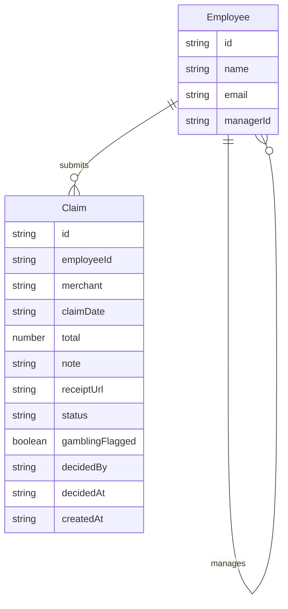

# Domain Model

The system tracks employees in a reporting hierarchy and the expense claims
they submit, each decided by the employee's own manager.

- `Employee.managerId` points at the `Employee` who approves this employee's
claims — the self-relation that gives every employee, including managers, a
manager.
- `Claim.status` is one of `submitted`, `approved`, `rejected`.
- `Claim.gamblingFlagged` is set by the receipt-reading agent; a flagged claim
cannot be submitted.
- `Claim.receiptUrl` points at the uploaded photo/PDF the claim was created
from.

