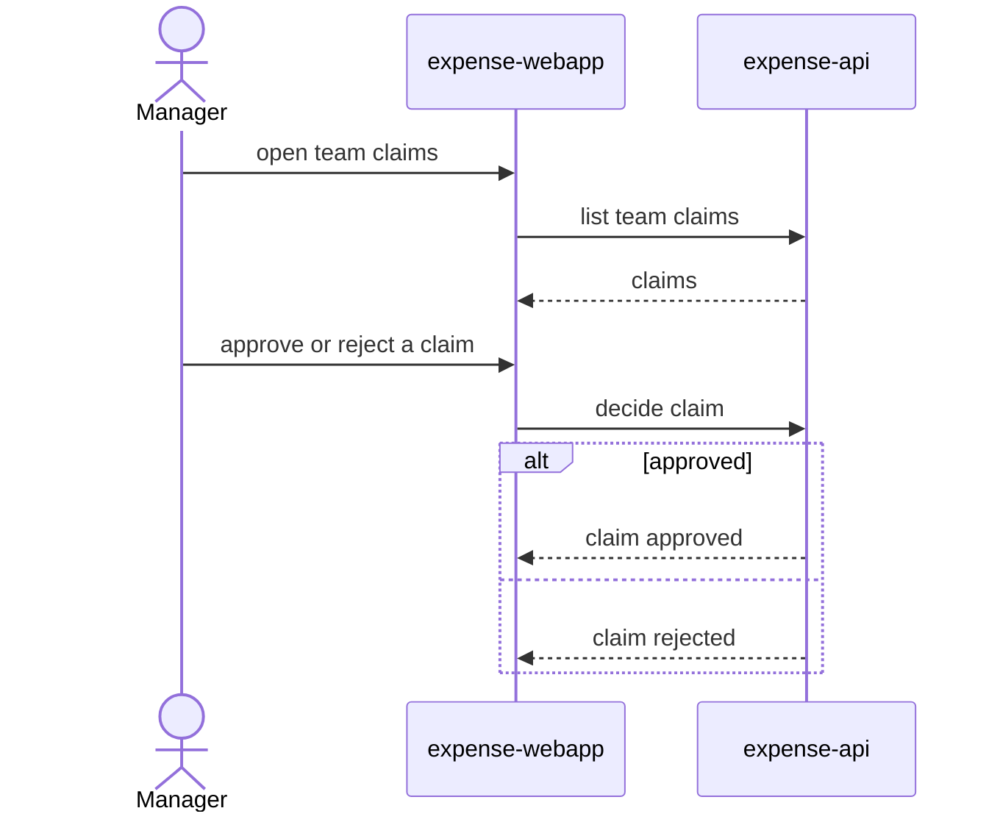

# Review and decide a claim

A Manager sees every claim submitted by their reports and approves or rejects
each one; a Manager's own claims are decided the same way by their own
manager.

```mermaid
sequenceDiagram
    actor Manager
    participant expense-webapp
    participant expense-api

    Manager->>expense-webapp: open team claims
    expense-webapp->>expense-api: list team claims
    expense-api-->>expense-webapp: claims

    Manager->>expense-webapp: approve or reject a claim
    expense-webapp->>expense-api: decide claim

    alt approved
        expense-api-->>expense-webapp: claim approved
    else
        expense-api-->>expense-webapp: claim rejected
    end
```

