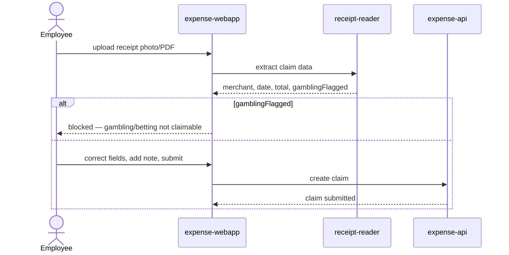

# Submit an expense claim

An Employee uploads a receipt, the Receipt Reader extracts its data, and the
Employee reviews and submits the claim to their manager — unless the receipt
is flagged as gambling or betting, in which case it cannot be submitted.

